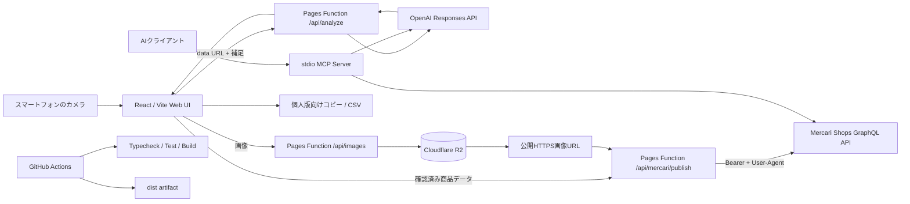

# Photo Marketplace Listing Assistant

スマートフォンで商品写真を撮り、AIでタイトル・説明・状態・価格候補・確認事項を生成するWebアプリです。**メルカリShopsは公式GraphQL APIで非公開/公開出品**まで行えます。個人版メルカリとYahoo!オークションは、公式の一般向け出品APIが確認できない、または自動出品が制限されるため、確認用原稿とCSVを生成します。

> AIは写真に写っていない型番、真贋、動作、傷を保証しません。出品者が必ず最終確認してください。

## できること

- スマホのカメラ撮影、最大4枚の写真選択、ブラウザ内画像圧縮
- OpenAI Responses APIの画像入力とStructured Outputsによる日本語出品原稿
- メルカリShops公式APIの `createProduct`、`productCategories`、`states`
- Cloudflare R2へ画像保存し、公式APIが取得できるHTTPS URLを発行
- 個人版メルカリ/Yahoo!オークション向けコピー・CSV
- stdio MCPサーバー（写真解析、公式API出品、原稿整形）
- Cloudflare Pages、GitHub Actions、Codespaces/devcontainer

## アーキテクチャと処理の流れ



詳細設計は [docs/architecture.md](docs/architecture.md)、初期設定は [docs/setup.md](docs/setup.md) を参照してください。

## 最短セットアップ

1. Cloudflare PagesのSettings → Variables and Secretsへ `OPENAI_API_KEY` をSecretとして登録。
2. R2 bucketを作り、Pagesプロジェクトに `LISTING_IMAGES` というbinding名で接続。
3. `PUBLIC_BASE_URL` にPages本番URLを登録。
4. メルカリShopsでAPI利用契約・Personal API Access Tokenを取得し、`MERCARI_SHOPS_TOKEN` と `MERCARI_SHOPS_USER_AGENT` をSecret登録。
5. まずSandboxと `UNOPENED`（非公開）でテスト。

メルカリShops APIはアクセストークンと正しいUser-Agentを要求します。また契約・環境によって日本国内の登録済み固定IPが必要です。Cloudflare Pagesの送信元を登録できない場合は固定IP relayを用意し、`MERCARI_API_PROXY_URL` に設定します。

## MCP

```bash
npm install
OPENAI_API_KEY=... npm run mcp
```

MCPクライアント設定例:

```json
{
  "mcpServers": {
    "photo-listing": {
      "command": "npm",
      "args": ["run", "mcp"],
      "cwd": "/absolute/path/to/photo-marketplace-listing-assistant",
      "env": {
        "OPENAI_API_KEY": "${OPENAI_API_KEY}",
        "MERCARI_SHOPS_TOKEN": "${MERCARI_SHOPS_TOKEN}",
        "MERCARI_SHOPS_USER_AGENT": "${MERCARI_SHOPS_USER_AGENT}"
      }
    }
  }
}
```

公開tools:

- `analyze_listing_photos`
- `publish_mercari_shops`
- `export_marketplace_draft`

## 開発・検証

```bash
npm install
npm run dev
npm run typecheck
npm test
npm run build
```

## 公式資料と採用判断

- Mercari Shops GraphQL API: `https://api.mercari-shops.com/docs/index.html`
- Production: `https://api.mercari-shops.com/v1/graphql`
- Sandbox: `https://api.mercari-shops-sandbox.com/v1/graphql`
- Yahoo!オークション旧Web API終了案内: `https://developer.yahoo.co.jp/changelog/2020-01-24-auction.html`

非公式スクレイピング、ログインCookie共有、CAPTCHA回避、個人アカウントへの無許可ブラウザ自動出品は採用していません。
