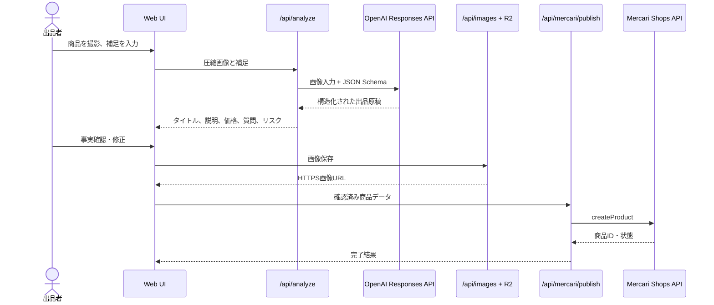

# Architecture

## 設計目標

1. 写真から原稿作成までをスマートフォンだけで完結する。
2. 認証情報をブラウザへ渡さない。
3. 公式APIがある経路だけをサーバー側で自動出品する。
4. AIの推測と出品者が確認した事実を区別する。
5. 個人アカウント向けの規約違反になり得るブラウザ自動操作を行わない。

## コンポーネント

- **React/Vite UI**: 撮影、圧縮、原稿編集、出力、出品確認。
- **`/api/analyze`**: OpenAI Responses APIへ最大4画像を送信し、JSON Schemaで原稿を受け取る。
- **`/api/images` + `/images/*`**: R2へ保存し不変HTTPS URLを返す。メルカリShops APIは画像バイナリではなくHTTPS URLを受け取る。
- **`/api/mercari/options`**: 公式 `productCategories`、`states`、available option queries。
- **`/api/mercari/publish`**: 公式 `createProduct` mutation。SecretsはCloudflare側だけに保存。
- **MCP stdio server**: エージェントから写真解析・原稿出力・公式API出品を呼び出す3 tools。
- **GitHub Actions**: 型検査、テスト、ビルド、dist artifact。

## データフロー

## セキュリティ境界

- OpenAI API keyとMercari Shops tokenはCloudflare SecretまたはMCPプロセス環境変数だけに置く。
- 個人版サービスのID、パスワード、Cookieは取得・保存しない。
- 画像URLはUUIDで推測困難だが公開URL。R2 lifecycleによる自動削除を運用で設定する。
- `OPENED`は即公開になるため、UI初期値は `UNOPENED`。
- AIが不確かな点は `questions`、禁止・規制品の疑いは `prohibited_risk` に分離する。

## 固定IP制約

メルカリShops API契約で日本国内の登録済み固定IPが要求される場合、Cloudflare Pages Functionsからの直接通信は適合しない可能性があります。固定IPを持つVPS、Cloud Run + Cloud NAT等へ薄い認証済みrelayを配置し、`MERCARI_API_PROXY_URL` を設定します。tokenをrelay側だけに置く構成にも拡張できます。

## 拡張候補

- R2 lifecycleによる画像自動削除
- 公式カテゴリ候補の自動ランキングとUI選択
- バーコード/JAN読み取り
- 正式契約された相場データソースとの連携
- webhookによる注文通知、在庫同期、発送ワークフロー
